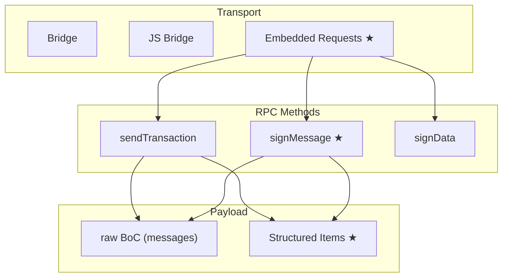
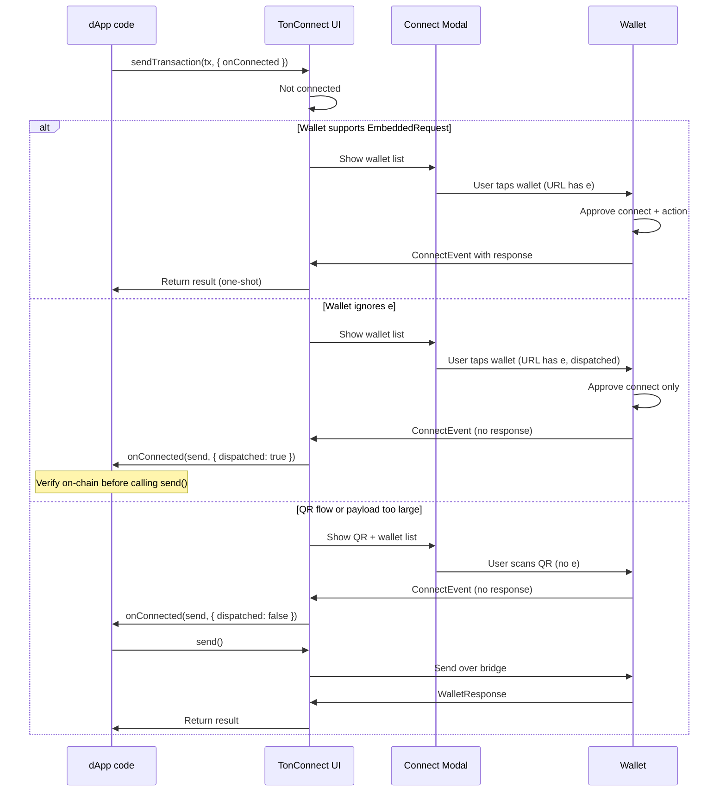

# TON Connect Protocol Extensions — PRD

## 1. Overview

This document defines requirements for three protocol extensions to TON Connect. Each extension is independent, backward-compatible, and ships as a separate change.

| #   | Extension              | What changes                    | One-liner                                                |
| --- | ---------------------- | ------------------------------- | -------------------------------------------------------- |
| 1   | **Structured Items**   | `sendTransaction` payload       | Typed items (TON/Jetton/NFT) instead of raw BoC          |
| 2   | **Sign Message**       | New RPC method `signMessage`    | Sign without broadcast (for gasless flows)                |
| 3   | **Embedded Requests**  | Connect URL format + SDK flow   | Embed request in connect link — connect+action in one tap |



★ = new. Bridge and JS Bridge carry all RPC methods (unchanged). `disconnect` is unaffected and omitted.

---

## 2. Problem Statement

### Current limitations

TON Connect is a session-based protocol. A dApp connects to a wallet, then sends RPC requests over an encrypted bridge. Three RPC methods exist: `sendTransaction`, `signData`, `disconnect`.

**No high-level transfer primitives.** `sendTransaction` accepts raw messages with binary BoC payloads. To transfer a Jetton, the dApp must resolve the Jetton wallet address, construct a `transfer#0f8a7ea5` cell with correct TL-B encoding, and Base64-encode it. Every dApp reimplements the same Jetton/NFT logic.

**No sign-without-broadcast.** Gasless transactions on TON (W5 wallets) require the wallet to sign an internal message without broadcasting it. A relayer wraps the signed message and pays gas. There is no standard RPC method for this — each wallet implements gasless internally.

**Two-step connect+action.** When a user is not connected, the developer must handle connection first, then call `sendTransaction` separately. This is two steps for the developer and two approval screens for the user. On mobile, this means two app switches.

### Goals

1. Let dApps describe transfers at a high level (TON, Jetton, NFT) — wallet handles BoC construction
2. Standardize sign-without-broadcast across all wallets for gasless/relayer flows
3. Enable single-tap connect+action on mobile, with safety against double payments
4. Each extension ships independently — wallets and dApps adopt incrementally

### Non-goals

- Server-side dynamic actions (deferred to a future spec)
- New infrastructure (no Object Storage or similar services)
- Changes to the JS Bridge injection mechanism
- Changes to `signData` or `disconnect`

---

## 3. User Stories

| As a...              | I want to...                                                   | So that...                                                  |
|----------------------|----------------------------------------------------------------|-------------------------------------------------------------|
| dApp developer       | Send a Jetton transfer without building BoC                    | I don't reimplement Jetton transfer logic in every dApp     |
| dApp developer       | Get a signed message BoC without it being broadcast            | I can submit it through a gasless relayer                   |
| dApp developer       | Call `sendTransaction` before the user is connected            | The user connects and approves in a single step             |
| dApp developer       | Know if an embedded request was already dispatched              | I can verify on-chain before retrying to avoid duplicates   |
| wallet developer     | Advertise which item types my wallet supports                  | The SDK only sends item types I can handle                  |
| wallet developer     | Receive an action embedded in the connect URL                  | I show one combined approval screen instead of two          |
| end user             | Connect and pay in a single tap on mobile                      | Fewer app switches and faster checkout                      |
| end user             | Not be prompted to pay twice for the same transaction          | My funds are safe even if the connection was flaky          |

---

## 4. Detailed Requirements

---

### 4.1 Structured Items

#### Summary

Add an optional `items` field to the `sendTransaction` and `signMessage` payloads. Each item describes **what** the user wants to do; the **wallet** constructs the BoC.

#### Requirements

- **R1.1** The payload MUST contain either `messages` or `items`, never both. If both are present, the wallet MUST reject with error code 1 (Bad request).
- **R1.2** Three item types MUST be supported: `ton`, `jetton`, `nft`.
- **R1.3** Wallets MUST advertise supported item types via `itemTypes` in their feature flag. If `itemTypes` is absent, the wallet only supports raw `messages`.
- **R1.4** The SDK MUST check the wallet's `itemTypes` before sending a request with `items`. If the wallet does not support the required types, the SDK MUST throw an error.
- **R1.5** Existing dApps using `messages` MUST continue to work without changes.

#### Item type definitions

**TonItem:**

| Field            | Type    | Required | Description                         |
|------------------|---------|----------|-------------------------------------|
| `type`           | `"ton"` | yes      | Item discriminator                  |
| `address`        | string  | yes      | Destination in user-friendly format |
| `amount`         | string  | yes      | Nanocoins as decimal string         |
| `payload`        | string  | no       | Raw one-cell BoC in Base64          |
| `stateInit`      | string  | no       | Raw one-cell BoC in Base64          |
| `extra_currency` | object  | no       | Extra currencies to send            |

**JettonItem:**

| Field                  | Type       | Required | Description                                          |
|------------------------|------------|----------|------------------------------------------------------|
| `type`                 | `"jetton"` | yes      | Item discriminator                                   |
| `master`               | string     | yes      | Jetton master contract address                       |
| `destination`          | string     | yes      | Recipient address                                    |
| `amount`               | string     | yes      | Jetton amount in elementary units                    |
| `attachAmount`         | string     | no       | TON to attach for fees; wallet calculates if omitted |
| `queryId`              | string     | no       | Arbitrary request number                             |
| `responseDestination`  | string     | no       | Where to send excess; defaults to sender             |
| `customPayload`        | string     | no       | Raw one-cell BoC in Base64                           |
| `forwardAmount`        | string     | no       | Nanotons to forward to destination                   |
| `forwardPayload`       | string     | no       | Raw one-cell BoC in Base64                           |

**NftItem:**

| Field                  | Type    | Required | Description                                          |
|------------------------|---------|----------|------------------------------------------------------|
| `type`                 | `"nft"` | yes      | Item discriminator                                   |
| `nftAddress`           | string  | yes      | NFT item contract address                            |
| `newOwner`             | string  | yes      | New owner address                                    |
| `attachAmount`         | string  | no       | TON to attach for fees; wallet calculates if omitted |
| `queryId`              | string  | no       | Arbitrary request number                             |
| `responseDestination`  | string  | no       | Where to send excess; defaults to sender             |
| `customPayload`        | string  | no       | Raw one-cell BoC in Base64                           |
| `forwardAmount`        | string  | no       | Nanotons to forward to new owner                     |
| `forwardPayload`       | string  | no       | Raw one-cell BoC in Base64                           |

#### Feature flag

Extend existing `SendTransaction` and new `SignMessage` features:

```json
{ "name": "SendTransaction", "maxMessages": 4, "extraCurrencySupported": true, "itemTypes": ["ton", "jetton", "nft"] }
{ "name": "SignMessage", "maxMessages": 4, "itemTypes": ["ton", "jetton", "nft"] }
```

`itemTypes` is optional. If absent, only raw `messages` are supported.

#### Protocol changes

- `sendTransaction` `params[0]` JSON gains an optional `items` field alongside `messages`
- `SendTransactionFeature` gains optional `itemTypes` array
- No change to `RpcMethod`, `AppRequest`, or wire format

#### SDK changes

```typescript
export type SendTransactionRequest =
    | SendTransactionRequestWithMessages   // { validUntil, network?, from?, messages }
    | SendTransactionRequestWithItems;     // { validUntil, network?, from?, items }

export type StructuredItem = TonItem | JettonItem | NftItem;
```

Logic: request has `messages` → send as-is. Request has `items` → check wallet `itemTypes`, convert to wire format, send or throw.

#### Acceptance criteria

- [ ] dApp can send a Jetton transfer using `items` without constructing BoC
- [ ] dApp can mix TON and Jetton items in one transaction
- [ ] Wallet rejects requests containing both `messages` and `items`
- [ ] Wallet without `itemTypes` in features never receives `items` requests
- [ ] Existing dApps using `messages` work without changes

---

### 4.2 Sign Message

#### Summary

New RPC method `signMessage`, peer of `sendTransaction`. The wallet signs an internal message using the Wallet V5 `internal_signed` opcode (0x73696e74) but does **not** broadcast it. The signed BoC is returned to the dApp.

#### Requirements

- **R2.1** The request payload MUST have the same structure as `sendTransaction` (supports both `messages` and `items`).
- **R2.2** The wallet MUST NOT broadcast the signed message to the network.
- **R2.3** The wallet MUST construct each outgoing message with send mode 3 (`PAY_GAS_SEPARATELY + IGNORE_ERRORS`).
- **R2.4** The response MUST contain `{ internalBoc: "<base64 signed internal message BoC>" }`.
- **R2.5** Wallets MUST advertise `SignMessage` in their feature flags.
- **R2.6** The SDK MUST throw if the wallet does not advertise `SignMessage`.

#### Wire format

Request:

```json
{
  "method": "signMessage",
  "params": ["<same JSON payload as sendTransaction>"],
  "id": "42"
}
```

Response:

```json
{
  "result": { "internalBoc": "<base64 signed internal message BoC>" },
  "id": "42"
}
```

#### Feature flag

```json
{ "name": "SignMessage", "maxMessages": 255, "extraCurrencySupported": true, "itemTypes": ["ton", "jetton", "nft"] }
```

Same shape as `SendTransaction`. `extraCurrencySupported` is optional (defaults to `false`).

#### Error codes

| Code | Description               |
|------|---------------------------|
| 0    | Unknown error             |
| 1    | Bad request               |
| 100  | Unknown app               |
| 300  | User declined the request |
| 400  | Method not supported      |

#### SDK changes

```typescript
// New method on TonConnect
signMessage(
    message: SignMessageRequest, // same type as SendTransactionRequest
    options?: OptionalTraceable<{ onRequestSent?: () => void; signal?: AbortSignal }>
): Promise<OptionalTraceable<SignMessageResponse>>;

interface SignMessageResponse {
    internalBoc: string;
}
```

`TonConnectUI.signMessage()` follows the same modal flow as `sendTransaction`, including embedded request support.

#### Acceptance criteria

- [ ] dApp can call `signMessage` and receive a signed BoC without it being broadcast
- [ ] Signed BoC can be submitted through a gasless relayer
- [ ] Wallet shows a distinct confirmation UI (sign, not send)
- [ ] SDK throws `TonConnectError` if wallet does not advertise `SignMessage`
- [ ] `signMessage` supports both `messages` and `items`

---

### 4.3 Embedded Requests

#### Summary

Embed an RPC request (e.g. a transaction) directly into the connect URL via an `e` parameter (embedded request). The wallet handles connection and action in a single step. This works on **mobile only** (universal links / deep links).

#### Requirements

- **R3.1** The `e` parameter MUST use a compact wire format with abbreviated field names to minimize URL length.
- **R3.2** The `e` parameter MUST only be embedded in wallet-specific universal links, never in QR codes.
- **R3.3** The `e` parameter MUST be embedded only on the first wallet tap (consumed after dispatch).
- **R3.4** If the wallet processes the embedded request, it MUST return the result in a `response` field on `ConnectEventSuccess`.
- **R3.5** The `response` field MUST NOT contain an `id` (the request was not assigned one by the app).
- **R3.6** If the wallet does not recognize `e`, it MUST silently ignore it and connect normally.
- **R3.7** Wallets MUST advertise support via `{ name: 'EmbeddedRequest' }` in their feature flags.
- **R3.8** If `onConnected` is called with `dispatched: true`, the dApp SHOULD verify on-chain status before calling `send()` to avoid duplicate transactions.
- **R3.9** If the payload is too large for the URL, the SDK MUST omit `e` and fall back to the two-step flow.

#### Double-payment safety

This is the critical safety concern. Consider:

1. User clicks "Pay 10 USDT", taps a wallet → universal link with embedded request (`e`) → wallet opens
2. User approves connect + payment → wallet broadcasts → payment DONE
3. User returns to dApp → SSE reconnecting → modal still visible
4. User taps the wallet again → new session → old `ConnectEvent` lost
5. Wallet connects on new session → no `response` field
6. If SDK auto-sends over bridge → user sees ANOTHER payment prompt → **double payment**

Safety rules that prevent this:

1. **No `e` in QR codes.** QR codes are inherently multi-scan. The embedded request (`e` param) is only in wallet-specific universal links.
2. **First tap only.** After the user is redirected, the request is consumed. Subsequent taps generate connect-only URLs. Only one wallet ever receives the embedded request.
3. **No auto-fallback after dispatch.** If `e` was dispatched and the wallet reconnects without a `response`, the SDK calls `onConnected` with `{ dispatched: true }`. The developer must verify on-chain status before retrying.



#### URL format

```
https://<wallet-universal-url>?v=2&id=<session_id>&trace_id=<trace_id>&r=<ConnectRequest>&e=<base64url(EmbeddedWireRequest)>&ret=back
```

The `e` parameter contains `base64url(JSON.stringify(EmbeddedWireRequest))` — a compact wire format with abbreviated field names.

#### Wire format

Every wire request has an `m` (method) field:

| `m` value | Method            |
|-----------|-------------------|
| `st`      | `sendTransaction` |
| `sm`      | `signMessage`     |
| `sd`      | `signData`        |

**Transaction wire request** (`m: 'st' | 'sm'`):

| Wire field | Full name    | Type           |
|------------|--------------|----------------|
| `m`        | method       | `'st'\|'sm'`   |
| `f`        | from         | string?        |
| `n`        | network      | string?        |
| `vu`       | valid_until  | number?        |
| `ms`       | messages     | WireMessage[]? |
| `i`        | items        | WireItem[]?    |

`ms` and `i` are mutually exclusive.

**WireMessage:**

| Wire | Full name      |
|------|----------------|
| `a`  | address        |
| `am` | amount         |
| `p`  | payload        |
| `si` | stateInit      |
| `ec` | extra_currency |

**WireItem** types follow the same abbreviation pattern:

- **WireTonItem** (`t: "ton"`): `a`, `am`, `p`, `si`, `ec`
- **WireJettonItem** (`t: "jetton"`): `ma`, `d`, `am`, `aa`, `rd`, `cp`, `fa`, `fp`, `qi`
- **WireNftItem** (`t: "nft"`): `na`, `no`, `aa`, `rd`, `cp`, `fa`, `fp`, `qi`

**SignData wire request** (`m: 'sd'`): `f`, `n`, `t` (type: text|binary|cell), plus type-specific fields (`tx`, `b`, `s`, `c`).

#### ConnectEventSuccess extension

```typescript
export interface ConnectEventSuccess {
    event: 'connect';
    id: number;
    payload: {
        items: ConnectItemReply[];
        device: DeviceInfo;
    };
    response?: WalletResponse<RpcMethod>; // NEW — present only if wallet processed e
}
```

The `response` follows the standard `WalletResponse` format but does **not** contain an `id` field.

On success (sendTransaction): `{ "result": "te6ccg...base64boc..." }`
On success (signMessage): `{ "result": { "internalBoc": "..." } }`
On error: `{ "error": { "code": 300, "message": "User declined the request" } }`

#### SDK public API

```typescript
// @tonconnect/ui — sendTransaction, signMessage, signData all accept onConnected
public async sendTransaction(
    tx: SendTransactionRequest,
    options?: ActionConfiguration & OptionalTraceable<{
        onRequestSent?: (redirectToWallet: () => void) => void;
        onConnected?: (
            send: () => Promise<SendTransactionResponse>,
            context: { dispatched: boolean }
        ) => Promise<SendTransactionResponse>;
    }>
): Promise<OptionalTraceable<SendTransactionResponse>>;

// @tonconnect/sdk — connect() accepts optional embeddedRequest
connect(
    wallet: WalletConnectionSource,
    options?: OptionalTraceable<{
        request?: ConnectAdditionalRequest;
        openingDeadlineMS?: number;
        signal?: AbortSignal;
        embeddedRequest?: EmbeddedRequest;
    }>
): string | void;

type EmbeddedRequest =
    | { method: 'sendTransaction'; request: SendTransactionRequest }
    | { method: 'signData'; request: SignDataPayload }
    | { method: 'signMessage'; request: SignMessageRequest };
```

#### Acceptance criteria

- [ ] dApp can call `sendTransaction` before connecting — user approves in a single tap
- [ ] Wallet that supports `EmbeddedRequest` returns result in `ConnectEventSuccess.response`
- [ ] Wallet that does not support `EmbeddedRequest` silently ignores `e` and connects normally
- [ ] `onConnected` is called with `dispatched: true` when the embedded request was sent (`e`) but no response received
- [ ] `onConnected` is called with `dispatched: false` for QR flow or when payload is too large
- [ ] `e` is never embedded in QR code URLs
- [ ] `e` is consumed after first wallet tap — subsequent taps do not contain it
- [ ] Payloads exceeding URL size limits fall back to the two-step flow
- [ ] `signMessage` and `signData` work with embedded requests (same pattern as `sendTransaction`)

---

## 5. Impact Summary

### For dApp developers

| "I want to..."                    | What to do                                                          |
|-----------------------------------|---------------------------------------------------------------------|
| Keep my app working               | Nothing — fully backward compatible                                 |
| Send Jettons without building BoC | Use `items` instead of `messages` in `sendTransaction`              |
| Support gasless transfers         | Call `signMessage()` (same payload shape as `sendTransaction`)      |
| Faster connect+action UX          | Pass `onConnected` callback to `sendTransaction` / `signMessage`    |
| Verify before retry               | Check `dispatched` flag in `onConnected` callback                   |

### For wallet developers

| Extension          | What to implement                                                                          | Effort |
|--------------------|--------------------------------------------------------------------------------------------|--------|
| Structured Items   | Parse `items` array, construct BoC for TON/Jetton/NFT transfers                            | Medium |
| Sign Message       | Same as sendTransaction but skip broadcast, use `internal_signed` opcode, return signed BoC | Small  |
| Embedded Requests  | Parse `e` param from URL, process embedded request, include `response` in `ConnectEvent`          | Small  |

### For end users

| Before                                                                          | After                                       |
|---------------------------------------------------------------------------------|---------------------------------------------|
| Tap wallet → approve connect → return to dApp → tap "Pay" → approve transaction | Tap wallet → approve connect + payment → done |
| Two app switches on mobile                                                      | One app switch                               |

---

## 6. Rollout

### Ordering

| Phase | Extension          | Depends on | Protocol change                                      |
|-------|--------------------|------------|------------------------------------------------------|
| 1     | Structured Items   | —          | Optional `items` field in sendTransaction payload    |
| 2     | Sign Message       | Phase 1    | New RPC method `signMessage`                         |
| 3     | Embedded Requests  | Phase 1–2  | `e` URL param + `response` field on `ConnectEvent` |

Each phase can ship and be adopted independently. Wallets can implement in any order. The SDK handles graceful degradation for all combinations.

### Feature flags (wallets-list registry)

Wallets advertise capabilities in `wallets-v2.json`:

```json
{
  "features": [
    { "name": "SendTransaction", "maxMessages": 255, "extraCurrencySupported": true, "itemTypes": ["ton", "jetton", "nft"] },
    { "name": "SignData", "types": ["text", "binary", "cell"] },
    { "name": "SignMessage", "maxMessages": 255, "extraCurrencySupported": true, "itemTypes": ["ton", "jetton", "nft"] },
    { "name": "EmbeddedRequest" }
  ]
}
```

DApps can filter wallets using `walletsRequiredFeatures` to only show wallets supporting the features they need.

### Backward compatibility

| Scenario                                 | Behavior                                                  |
|------------------------------------------|-----------------------------------------------------------|
| Old wallet receives `items`              | Never happens — SDK checks `itemTypes` before sending     |
| Old wallet receives `signMessage`        | Never happens — SDK checks feature flag before sending    |
| Old wallet receives URL with `e`       | Ignores unknown param, connects normally                  |
| Old SDK receives `ConnectEvent.response` | Ignores unknown field                                     |
| Existing dApp using `messages`           | Works without changes                                     |
| New dApp, old wallet without `itemTypes` | SDK throws — dApp falls back to `messages` or shows error |

---

## 7. Related Documents

- [Wallet Integration Guide](./guidelines/sign-message-items-embedded-requests.md) — implementation guide for wallets
- [DApp Developer Guide](guidelines/sign-message-items-embedded-requests-dapps.md) — usage guide for dApp developers
- [Requests and Responses spec](https://github.com/ton-blockchain/ton-connect/blob/main/requests-responses.md)
- [Wallets List registry](https://github.com/ton-blockchain/wallets-list)
- [Wallets V2 JSON schema](https://github.com/ton-blockchain/wallets-list/blob/main/wallets-v2.schema.json)
